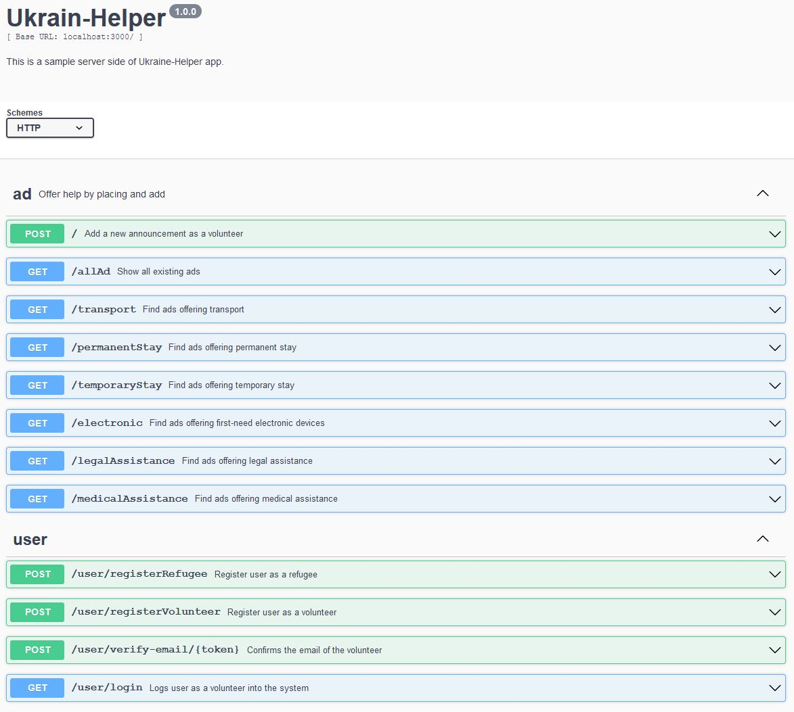

# Coders Camp 2021 (7th ed.) | Team project | TypeScript + React + NodeJS

## Team project 

---

### Mentor:

- [Jędrzej Ratajczak](https://github.com/Nilphym)

### Contributors:

- [Krzysztof Gumularz](https://github.com/KrisGum)
- [Przemysław Gajowczyk](https://github.com/Przemyslaw-G)
- [Marcin Kukułka](https://github.com/MarcinKukulka)
- [Dawid Żłobecki](https://github.com/DawidZlobecki)

## Ukraine Helper 
---
 Ukraine Helper - is a propotype of an app which will allow fast, direct contact to those who are in need with those who would like to offer their help.    

 Prototype and Mockup of the project

[Prototype](https://miro.com/app/board/uXjVOA4NvrU=/?utm_source=notification&utm_medium=email&utm_campaign=daily-updates&utm_content=go-to-board)

[Mockup](https://www.figma.com/file/wsit0RU6VdlQY3WJN7gU82/Ukraine-helper?node-id=0%3A1)

--
## Demo 

A demo version of the application is not yet available...

---    

## Project idea and main objective 🔍

For the past two months we are witnessing the war behind our east boarder. As the outcome of this horrible situation, polish frontier guard expirience the massive border traffic. In line with all sorts of volunteer they were trying to help fleeing refugees. The following app has been designed to become a tool for those who wish to help in all sorts of way, by placing very short, compact ads. The app works for two scenarios: refugee and volunteer and aims to fullfil the need for most possible to come situation for both sides.
## FrontEnd
Preview of our website:

## BackeEnd
A sneak-peek of our app's server side:

## Used technologies ⚡

And in addition, we also used:

- nodemailer
- luxon
- react router dom
- prettier
- yup
- joi
- GitHub Actions
- dotenv
- axios
- envalid

